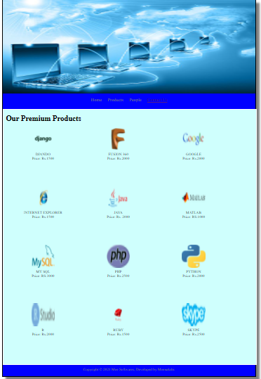

# Web Design for a Software Product Company

## AIM:

To design a static website for a software product company company.

## DESIGN STEPS:

### Step 1:

Requirement collection.

### Step 2:

Creating the layout using HTML and CSS.

### Step 3:

Updating the sample content.

### Step 4:

Choose the appropriate style and color scheme.

### Step 5:

Validate the layout in various browsers.

### Step 6:

Validate the HTML code.

### Step 6:

Publish the website in the given URL.

## PROGRAM :
### Home Page:
~~~
<!DOCTYPE html>
<html lang="en">
  <head>
    <title>Mee Softwares</title>
    <link rel="stylesheet" href="./css/layout.css" />
    <link rel="icon" href="./img/icon.png" type="image/x-icon" />
  </head>

  <body>
    

      
Mee Softwares

      

        
<a href="home.html">Home</a>

        
<a href="products.html">Products</a>

        
<a href="products.html">People</a>

        
<a href="contactus.html">Contact Us</a>

      

      

        

          <h1>About Us</h1>
          
          

            At Tally, we believe in the power of technology to make business
            owners efficient, empowered and happier, so they can focus on what
            matters most for their business. We design our products to focus on
            just that to make our products work for you, and not the other way
            around.
             
            Our new product TallyPrime takes this to a new level, making your
            start to automation, or your switch to Tally simpler than ever
            before. You can now discover the product much more easily and make
            the product do more for you, without learning anything new. There is
            greater flexibility as the product adapts to your business and your
            way of working. And the transformed look and feel will only make you
            love the product even more.
            <ul>
              <li>Simple to learn, easier to use</li>
              <li>Insightful , actionable & customizable reports</li>
              <li>Anywhere, anytime and secure access</li>
            </ul>
          

        

      

      

        Copyright &#169; 2021 Mee Softwares, Developed by Meenakshi.
      

    

  </body>
</html>
~~~
### Product Page:
~~~
<!DOCTYPE html>
<html lang="en">
  <head>
    <title>Mee Softwares</title>
    <link rel="stylesheet" href="./css/layout.css" />
    <link rel="icon" href="./img/icon.png" type="image/x-icon" />
  </head>

  <body>
    

      

      

        
<a href="/static/home.html">Home</a>

        
<a href="/static/products.html">Products</a>

        
<a href="/static/people.html">People</a>

        
<a href="/static/contactus.html">Contact Us</a>

        

      

            
    
          <h1>Our Premium Products</h1>
          

              
 
                  

                  
                  

                  
DJANDO

                  
Price: Rs.1500

              

              
 
                  

                  
                  

                  
FUSION 360

                  
Price: Rs.2000 

              

              
 
                

                
                

                
GOOGLE

                
Price: Rs.2000 

            

            
 
              

              
              

              
INTERNET EXPLORER

              
Price: Rs.1500

          

          
 
            

            
            

            
JAVA

            
Price: Rs. 2000

        

        
 
          

          
          

          
MATLAB

          
Price: RS.1000

      

      
 
        

        
        

        
MY SQL

        
Price: RS.3000

    

    
 
      

      
      

      
PHP

      
Price: Rs.2500 

  

  
 
    

    
    

    
PYTHON

    
Price: Rs.2000 

 
  

  
  

  
R

  
Price: Rs.2000

 
  

  
  

  
RUBY

  
Price: Rs.1500

 
  

  
  

  
SKYPE

  
Price: Rs.2500

          

          
        
      

      

        Copyright &#169; 2021 Mee Softwares, Developed by Meenakshi.
      

    

  </body>
</html>
~~~
### People Page:
~~~
<!DOCTYPE html>
<html lang="en">
  <head>
    <title></title>
    <link rel="stylesheet" href="./css/layout.css" />
    <link rel="icon" href="./img/icon.png" type="image/x-icon" />
  </head>

  <body>
    

      
Mee Softwares

      

        
<a href="/static/home.html">Home</a>

        
<a href="/static/products.html">Products</a>

        
<a href="/static/people.html">People</a>

        
<a href="/static/contactus.html">Contact Us</a>

      

      

        
    
            <h1>SUPPORTERS OF OUR SOFTWARES</h1>
            

                
 
                    

                    
                    

                    
BILL GATES

                    
MICROSOFT

                

                
 
                    

                    
                    

                    
DAVE CUTLER

                    
WINDOWS NT

                

                
 
                    

                    
                    

                    
JAMES GOSLING

                    
JAVA

                

                
 
                    

                    
                    

                    
JIMMY WALES

                    
WIKIPEDIA

                

                
 
                    

                    
                    

                    
MICHAEL WIDENIUS

                    
MY SQL

                

                
 
                    

                    
                    

                    
PAUL BUCHHEIT

                    
GMAIL

                

          

        

      

      

        Copyright &#169; 2021 Navi company, Developed by Naveenkumar.
      

    

  </body>
</html>
~~~
### Contact Page:
~~~
<!DOCTYPE html>
<html lang="en">   
  <head>
    <title>Mee Softwares</title>
    <link rel="stylesheet" href="./css/layout.css" />
    <link rel="icon" href="./img/icon.png" type="image/x-icon" />
  </head>

  <body>
    

      

      

        
<a href="/static/home.html">Home</a>

        
<a href="/static/products.html">Products</a>

        
<a href="/static/people.html">People</a>

        
<a href="/static/contactus.html">Contact Us</a>

        

      

                <ul>
              <h1>Address:</h1> 
                <li>Mee Softwares,KANCHIPURAM  </li>
              <li><h1>Contact:</h1>123456787; </li>
              <li><h1>E-mail:</h1>meesoftwares@gmail.com</li>
               VERIFIED*
          </ul>    
        

    

    

    

      

        Copyright &#169; 2021 Mee Softwares, Developed by Meenakshi.
      

    

  </body>
</html>
~~~
## OUTPUT:

### Home Page:

### Product Page:

### People Page:

### Contact Page:

## Result:

Thus a website is designed for the software product company and the HTML,CSS code are validated.
